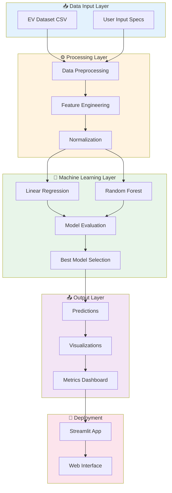
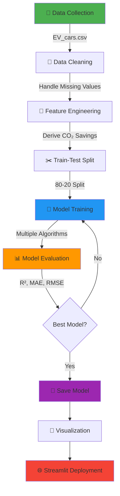
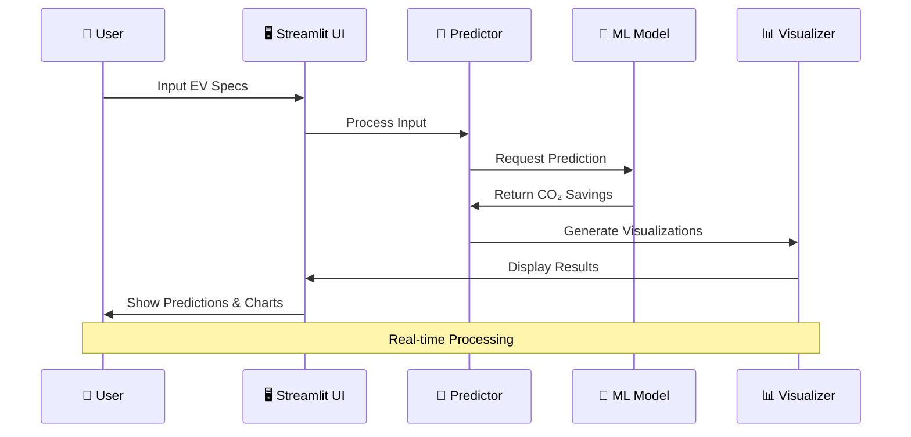

# 🌍 CO₂ Emission Savings Estimator

<div align="center">


**An AI-powered tool to predict and visualize CO₂ emission savings from Electric Vehicles**

[Features](#-features) • [Usage](#-usage) • [Architecture](#-system-architecture) 

---

### 🎯 Project Impact

```
🌱 Quantify Environmental Impact  |  📊 Data-Driven Insights  |  🚗 EV vs Petrol Comparison
```

</div>

---

## 📋 Table of Contents

- [Problem Statement](#-problem-statement)
- [Solution Overview](#-solution-overview)
- [Features](#-features)
- [System Architecture](#-system-architecture)
- [ML Pipeline](#-ml-pipeline)

---

## 🔴 Problem Statement

> **Climate change caused by excessive CO₂ emissions is a critical global challenge.**

### The Gap

| Current Scenario | The Problem |
|-----------------|-------------|
| ✅ EVs reduce pollution | ❌ No quantifiable metrics (kg/tons CO₂) |
| ✅ EV specs available | ❌ Not linked to emission data |
| ✅ Users want eco-choices | ❌ Can't compare environmental impact |

### Our Mission

Build an **ML-powered estimator** that converts EV specifications into measurable CO₂ savings, enabling:
- 🎯 Quantified environmental impact
- 📈 Predictive analytics for new EV models
- 🔍 Comparative analysis across vehicles
- 💚 Data-driven eco-conscious decisions

---

## 💡 Solution Overview


### Key Capabilities

| Feature | Description |
|---------|-------------|
| 🔮 **Predictive Modeling** | Regression algorithms estimate CO₂ savings from EV specs |
| 📊 **Data Visualization** | Interactive charts showing environmental impact |
| ⚡ **Real-time Calculation** | Instant predictions for custom EV configurations |
| 🌳 **Impact Translation** | Convert savings to trees planted or petrol saved |

---

## ✨ Features

### 🎯 Core Functionality

- **🔢 CO₂ Savings Calculator**
  - Input: Battery capacity, Range, Efficiency
  - Output: Total CO₂ saved (kg/year)
  
- **📊 Comparative Analysis**
  - EV vs Petrol vehicle emissions
  - Top 10 eco-friendly EVs ranking
  
- **🎨 Interactive Dashboard**
  - Streamlit-based web interface
  - Real-time slider inputs
  - Dynamic visualizations

- **🌱 Environmental Metrics**
  - Equivalent trees planted
  - Petrol consumption avoided
  - Annual carbon footprint reduction

---

## 🏗️ System Architecture



---

## 🔄 ML Pipeline

### Step-by-Step Workflow



### Feature Engineering Formula

The core calculation for CO₂ savings:

```python
# CO₂ emissions comparison
CO2_petrol = 150  # g/km (average petrol car)
CO2_EV = 80       # g/km (average EV with grid electricity)

# Total savings calculation
CO2_savings_total = Range_km × (CO2_petrol - CO2_EV) / 1000  # in kg
```

**Example:**
- EV Range: 400 km
- Savings per full charge: 400 × (150 - 80) / 1000 = **28 kg CO₂**
- Annual savings (15,000 km/year): **1,050 kg CO₂**

---


## 📊 Data Flow



---


</div>
